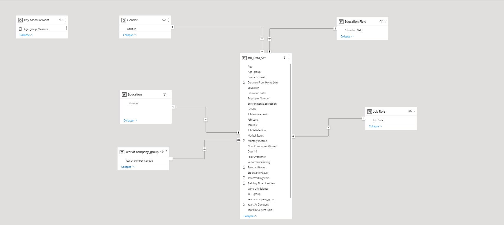
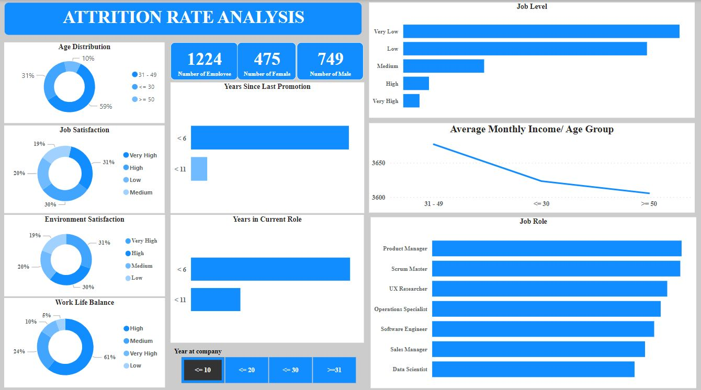
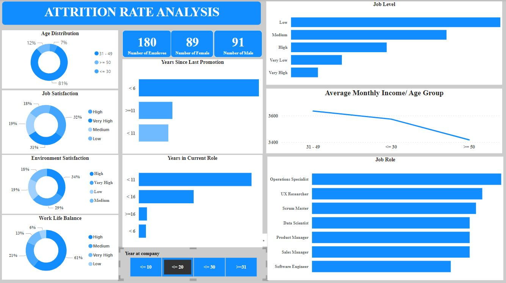
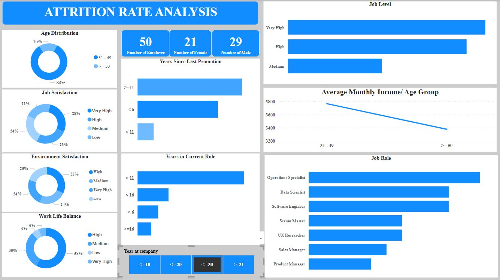
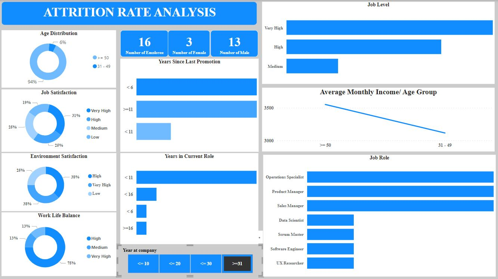
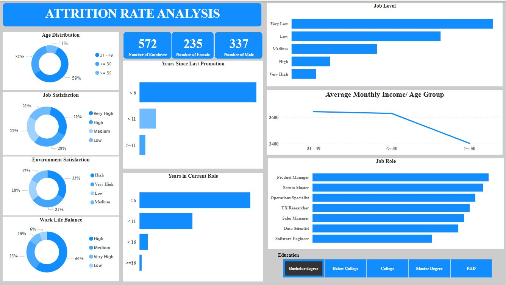
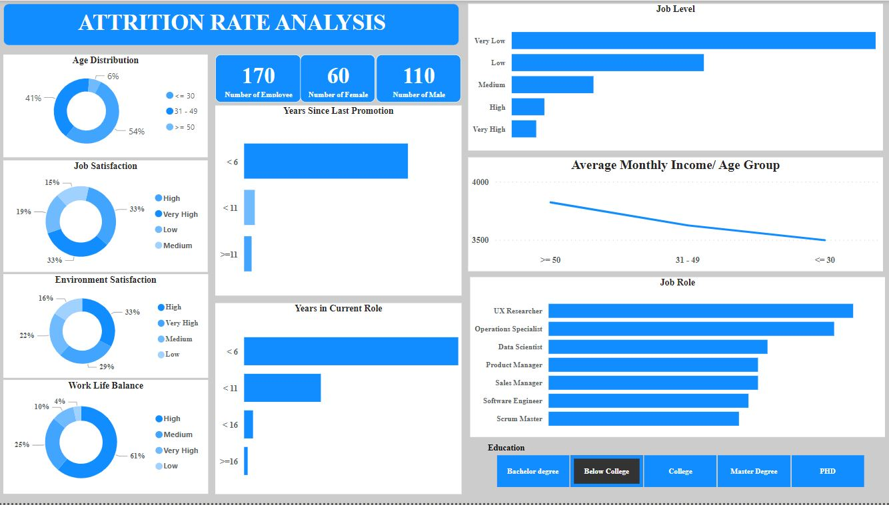
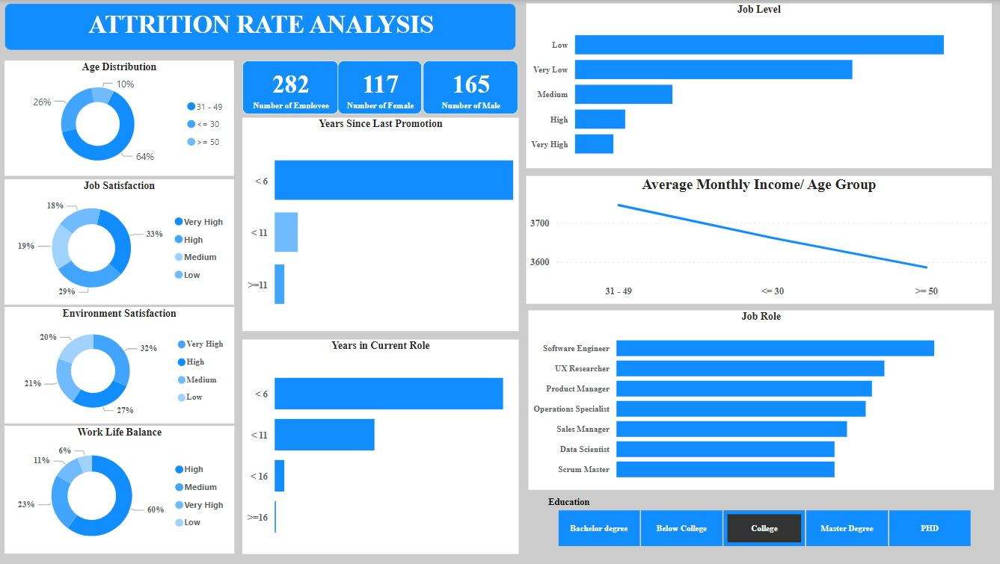
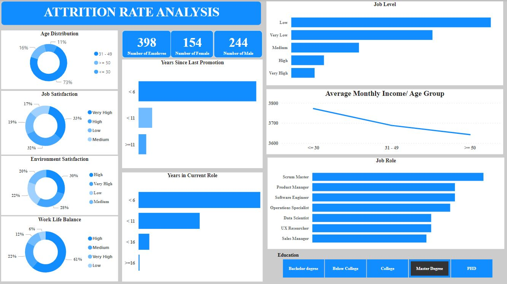
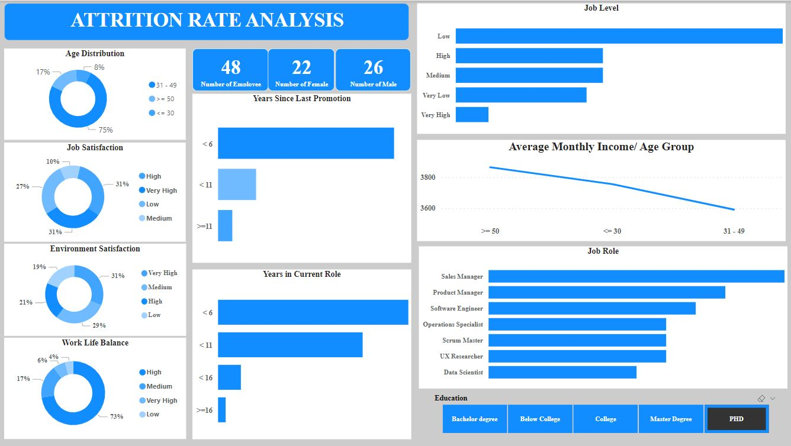

# Attrition Rate Analysis

## Introduction:
This is a Power BI project on investigating key indicators that can lead to attrition rate in the organisation. The project is to analyze and derive insight to answer crucial questions and drive decision making. 
**_Disclaimer_**: The data set is not real but just to show the use of Power BI

## Problem Statement
1. The impact of education level on key factor such as average salary, job satisfaction, environmental satisfaction, and more
2. The impact of years at company on key factor such as average salary, job satisfaction, environmental satisfaction, and more

## Skills/Concept demontration:
The following Power BI features were incorporated:
- DAX,
- Quick Measure,
- Filters'
- Data Cleaning
- Modelling

## Modelling:
Automatically derived relationships are adjusted to remove and replace unwanted relationship with the required

There are 5-dimentional tables and 1 fact table. The dimention tables are all joined to the fact table with a one-to-many relationship

## Visualization and Analysis:

Below analysis gives insight on the impact of employee who have served for less than and equal to 10 year

- The age group of 31-49 years recieve more significant average salary compare to other age group and this same age group comprise of 59%
- 5% have low work life balance
- 19% have low environmental satisfaction
- 20% have low job satisfaction
- Large amount of them are between low to medium job level and have been promoted since less than 6years
---

Below analysis gives insight on the impact of employee who have served for 11 to 20 years

- The age group of 31-49 years recieve more significant average salary compare to other age group and this same age group comprise of 81%
- 6% have low work life balance
- 19% have low environmental satisfaction
- 18% have low job satisfaction
- Large amount of them are between low to medium job level and a significant number at high level and have been promoted since less than 6years
---
Below analysis gives insight on the impact of employee who have served for 21 to 30 years

- The age group of 31-49 years recieve more significant average salary compare to other age group and this same age group comprise of 84%
- 6% have low work life balance
- 20% have low environmental satisfaction
- 22% have low job satisfaction
- Large amount of them are between very high to medium job level 
---

Below analysis gives insight on the impact of employee who have served for greater than 30 years

- The age group of >= 50 years recieve more significant average salary compare to other age group and this same age group comprise of 6%
- Work life balance is between very high to low level
- 25% have low environmental satisfaction
- 19% have low job satisfaction
- Large amount of them are between very high to medium job level
- They are at specialist to manager level
---

Below analysis gives insight on the impact of employee with education level of Bachelor degree

- The age group of 31-49 and <=30 years recieve more significant average salary compare to other age group and this same age group comprise of 59%
- 6% have low work life balance
- 18% have low environmental satisfaction
- 21% have low job satisfaction
- Large amount of them are between very low to medium job level
---

Below analysis gives insight on the impact of employee who have Education level of Below college level

- The age group of >= 50 years recieve more significant average salary compare to other age group and it decline from the highest age to the lowest and this same age group    comprise of 6%
- 4% have low work life balance
- 16% have low environmental satisfaction
- 19% have low job satisfaction
- Large amount of them are between very low to medium job level
---

Below analysis gives insight on the impact of employee who have Education level of college level

- The age group of 31-49 years recieve more significant average salary compare to other age group and it decline as age increase and this same age group comprise of 64%
- 6% have low work life balance
- 20% have low environmental satisfaction
- 18% have low job satisfaction
- Large amount of them are between very low to medium job level
---

Below analysis gives insight on the impact of employee who have Education level of Master degree level

- The age group of <= 30 years recieve more significant average salary compare to other age group and it decline as age increase and this same age group comprise of 11%
- 6% have low work life balance
- 22% have low environmental satisfaction
- 19% have low job satisfaction
- Large amount of them are between low to medium job level
---

Below analysis gives insight on the impact of employee who have Education level of PHD level

- The age group of >= 50 years recieve more significant average salary compare to other age group and this same age group comprise of 17%
- 4% have low work life balance
- 19% have low environmental satisfaction
- 27% have low job satisfaction

---

## Conclusion:

The analysis have showned significant relationship among key variables which have indicated gaps that can lead to high attrition rate in the organisation

## Recommendation:

Further investigation and analysis should be conducted to close relevant gap that can lead to high attrition in the organisation to prevent top talent from leaving the organisation
